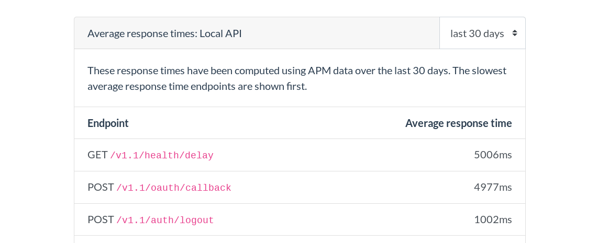

# HowFast APM agent for Python

[](https://pypi.org/project/howfast-apm/)
[](https://circleci.com/gh/HowFast/apm-python)
[](https://www.howfast.tech/#/monitors/https:%2F%2Fwww.howfast.tech%2F?pk_campaign=badge)
[](https://coveralls.io/github/HowFast/apm-python?branch=master)


This Python APM (Application Performance Monitoring) agent sends performance data to your
[HowFast](https://www.howfast.tech/) account.

It only supports Flask for now.



## Usage

```bash
pip install howfast-apm[flask]
```

Then, follow the instructions detailed in [the package page](https://pypi.org/project/howfast-apm/).

## Develop

```bash
# Install dependencies, including the one needed to develop
poetry install -v -E flask
# To build a new version
poetry build
poetry publish
```

## Test

```bash
# Lint the code
poetry run flake8 howfast_apm

# Run the tests
poetry run pytest

# Run the tests across a matrix of Python versions and Flask versions
# make sure all the relevant Python versions are available locally
cat .python-version | xargs -x -l1 pyenv install --skip-existing
# run the tests on the selected versions
poetry run tox
```

## Publish

```bash
# Replace "minor" by "patch" or "major" depending how you want to bump the version
poetry version minor
# Commit the changes
git add pyproject.toml && git commit -m "Bump version"
# Build and publish
poetry publish --build
```
